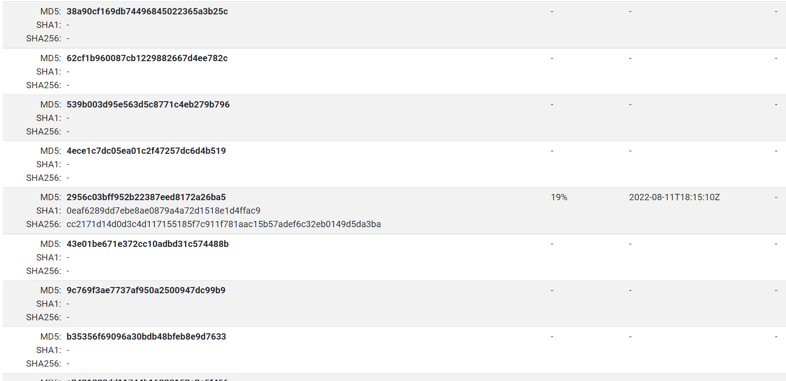

# A needle in a haystack

## Description

Bob receives a whitelist of md5 hash. However, due to carelessness, he mistakenly copied a md5 hash of a malware into the list above. Please help him find the sha256 hash of this malware. Submit: ASCIS{SHA256}

## Solution

Đại khái bài này cho ta 1 list md5 hash trong đó có 1 cái md5 hash của 1 con malware nào đó, nhiệm vụ của ta là tìm ra con malware đó và flag là SHA256 của nó. Mình thử tìm dabase md5 hash của các con malware phổ biến, sau một hồi mò thì anh RE team mình có gửi mình [trang này](https://hash.cymru.com/)

Và sau một hồi mình cũng tìm ra nó...

**Flag: ASCIS{CC2171D14D0D3C4D117155185F7C911F781AAC15B57ADEF6C32EB0149D5DA3BA}**

