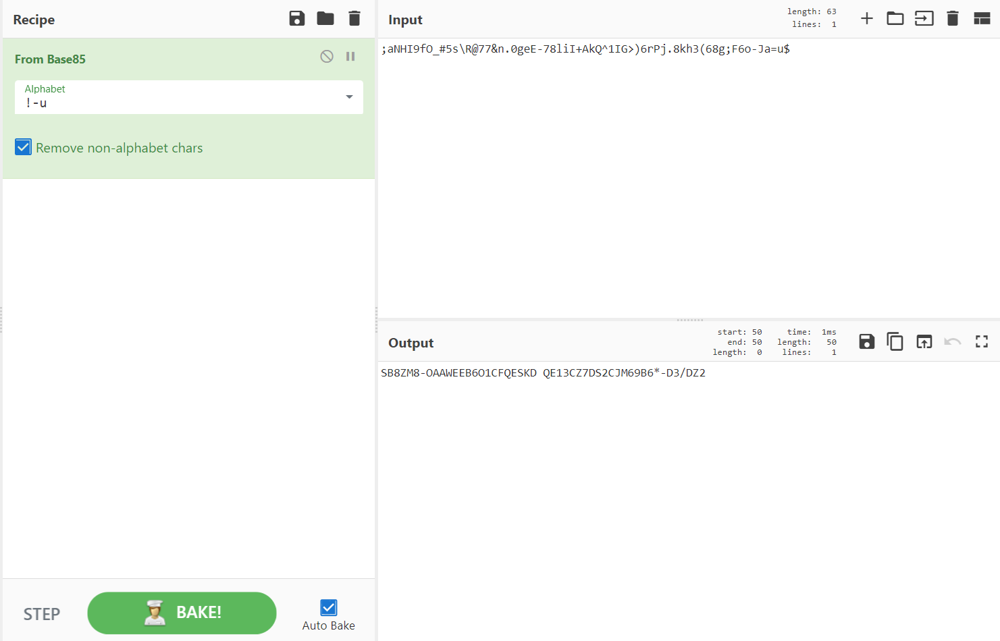
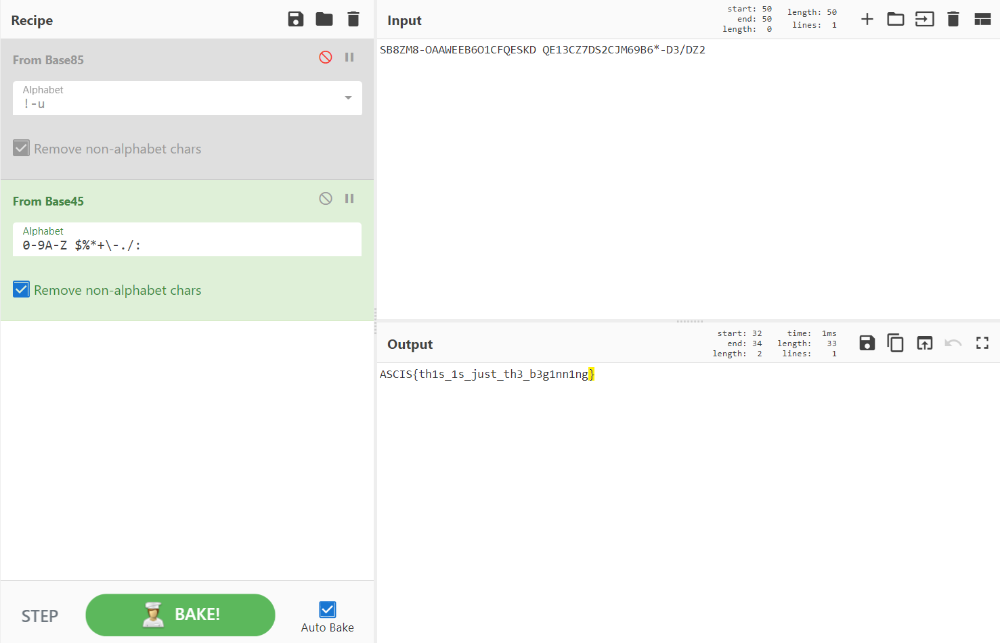

# Bases Combination

## Description

This is the combination of 2 bases

;aNHI9fO_#5s\R@77&n.0geE-78liI+AkQ^1IG>)6rPj.8kh3(68g;F6o-Ja=u$

## Solution

Đọc mô tả đề mình đoán bài này flag sẽ encode liên tiếp dùng 2 base khác nhau nên mình lên [CyberChef](https://gchq.github.io/CyberChef/) để kiểm tra thử

Base85:

Base45:

**Flag: ASCIS{th1s_1s_just_th3_b3g1nn1ng}**