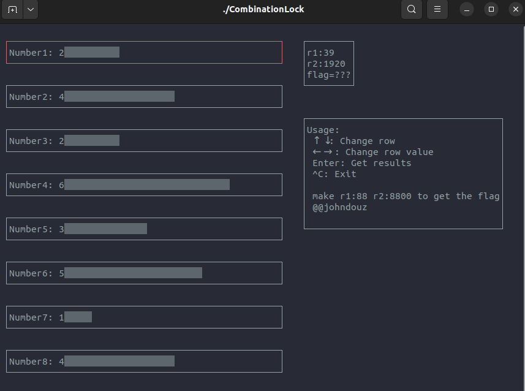
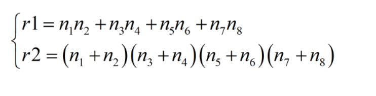
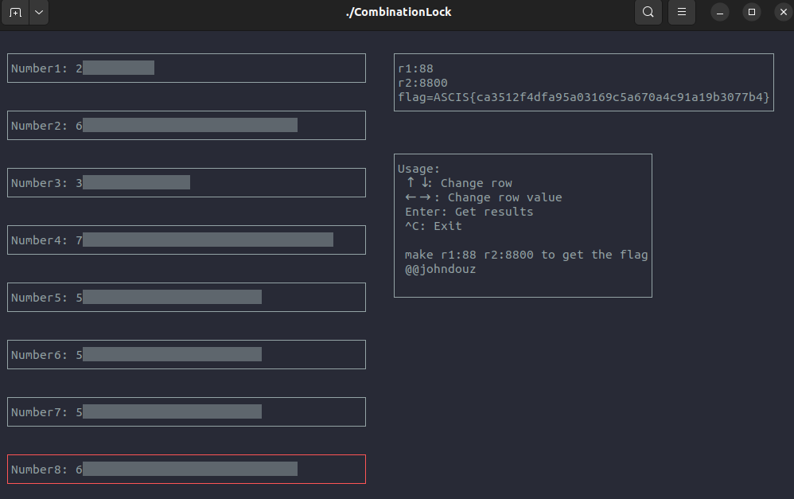

# Combination Lock

## Description

Unlock the Combination Lock to get the flag. Usage insde the "Lock".

## Solution

Thử chạy file xem sao...

Có vẻ như ta phải nhập 1 cái key 8 chữ số (mỗi chữ số từ 1 -> 8) sao cho r1 = 88 và r2 = 8800 thì nó mới nhả flag. 

Lúc đầu mình nghĩ đây là 1 chall thuần RE nên mình có đưa cho anh RE team mình. Nhưng sau đó 1 lúc thì anh WEB team mình thấy được quy luật biến đổi của r1 nên mình với anh ấy đã hợp sức và sau 1 lúc cũng tìm thấy nó :v

Tới đây chỉ việc viết [script](./genkey.py) gen key rồi lấy flag hoyy

**Flag: ASCIS{ca3512f4dfa95a03169c5a670a4c91a19b3077b4}**
