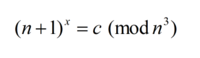
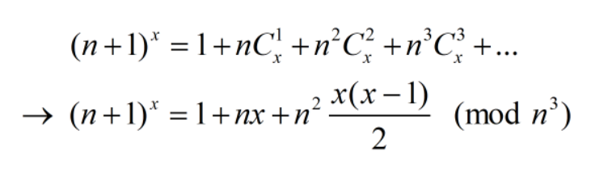

# Binned

## Description

People binned to the same public ID have no real-world connection to one another.

## Solution

Ở bài này đại khái chúng ta sẽ đi giải phương trình

với n, c là các số cho trước, flag là x cần tìm. Cơ số (1 + n) gợi ý chúng ta khai triển Newton...

Như vậy ta đã có một phương trình đồng dư với ẩn là flag, tuy nhiên do n khá lớn so với flag nên ta có thể giải được trên ZZ luôn (thay vì Zmod(n^3))

Code mình để [ở đây](./sol.py)

**Flag: ASIS{8!N0miaL_3XpAn5iOn_Us4G3_1N_cRyp7o_9rApHy!}**