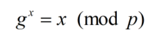
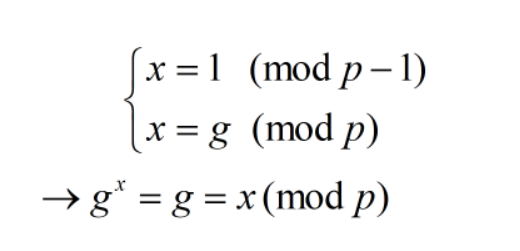

# Mariana

## Description

Mariana works in the areas of cryptography and security. But some flaws exists in her work!

## Solution

Bài này bắt chúng ta giải phương trình

với p là số nguyên tố, g bất kì trong khoảng (3, p). Nhiệm vụ của ta là tìm x và pass qua 40 rounds (sau mỗi round p sẽ tăng dần) để lấy flag. Sau một hồi lựa chọn thì thật bất ngờ mình thấy 1 họ nghiệm thỏa yêu cầu đề đơn giản như sau

Một vấn đề nho nhỏ là nếu tính crt([1, g], [p - 1, p]) thì kết quả sẻ lớn hơn p, nhưng đề chỉ giới hạn x < p chứ không quan tâm cận dưới của x nếu lúc nay chỉ việc "dịch xuống" 1 bậc: x = crt([1, g], [p - 1, p]) - p(p - 1) là sẽ thỏa!

Code mình để [ở đây](./sol.py)

**Flag: ASIS{fiX3d_pOIn7s_f0r_d!5Cret3_l0g4riThmS!}**

