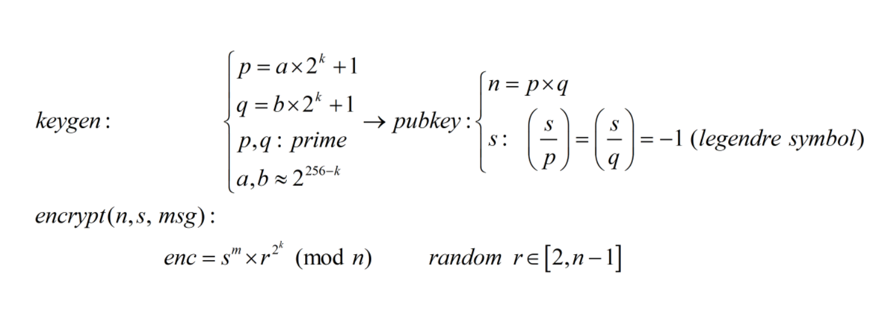
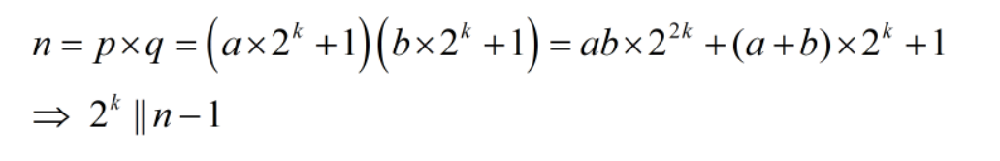
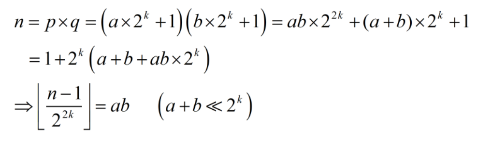
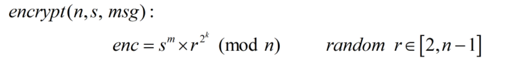
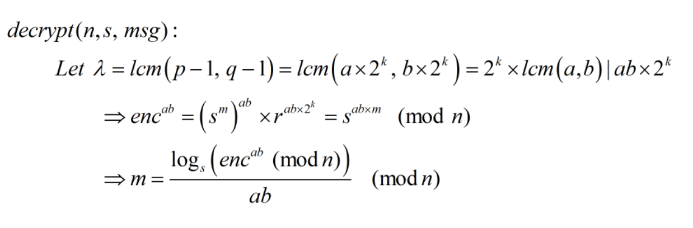

# Mindseat

## Description

Cryptography Mindset: Be Unpredictable, build robust and stable applications where you'll handle every situation that user can face or predict.

## Solution

Ý tưởng bài này như sau: đầu tiên chia flag thành 4 phần, mỗi phần 8 bytes, sau đó encrypt từng phần như sau:

Đầu tiên ta sẽ tìm cách khôi phục số k...

ở đây ta thấy k sẽ là số mũ đúng mod 2 của n - 1 nếu a + b lẻ. Vì a, b chọn ngẫu nhiên và ta có tới 4 bộ pubkey nên khả năng cao sẽ có 1 bộ mà a + b lẻ, từ đó ta khôi phục được k = 134

Một cách tự nhiên ta sẽ quan tâm tới đại lượng phi(n)...

ở đây ta đã có k vậy thử tìm ab xem...

tới đây ngon rồi!!! Ta đã có thể tính được phi(n) kết hợp với n ta hoàn toàn tìm được p, q. Vậy ta đã xử lý được phần pubkey, bây giờ tìm cách decrypt nữa là xong...

Ở đây r là một số random bất kì, chúng ta không biết. Vậy suy nghĩ một cách tự nhiên là chúng ta sẽ tìm cách loại bỏ r và chuyển sang giải DLP thoy...

Xong rồi, viết script lấy flag hoyyy!!! Mình đề code [ở đây](./sol.py) nè

**Flag: ASIS{N3w_CTF_nEW_Joye_Libert_CrYpt0_5}**

