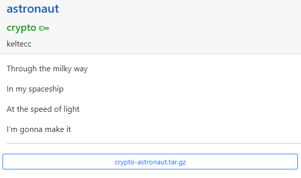
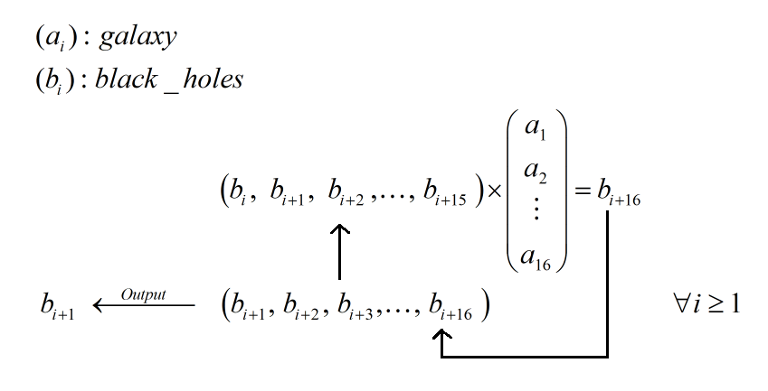

# Astronaut



Đầu tiên ta đọc qua source đề cho...

```python
#!/usr/bin/env python3

import os
import random
from typing import List, Generator


def flight(galaxy: List[int], black_holes: List[int]) -> Generator[int, None, None]:
    while True:
        yield (
            black_holes := black_holes[1:] + [
                sum(x * y for x, y in zip(galaxy, black_holes))
            ]
        )[0]


def main():
    rnd = random.SystemRandom(1337)
    limit = 1000

    galaxy = [rnd.randrange(0, limit) for _ in range(16)]
    black_holes = [rnd.randrange(0, limit) for _ in range(16)]

    emotions = os.getenv('FLAG').strip()
    emptiness = '\0' * 64

    message = (emotions + emptiness).encode()
    astronaut = flight(galaxy, black_holes)

    for memory in message:
        print(memory ^ next(astronaut) % limit, end = ' ')


if __name__ == '__main__':
    main()

# Output
# 676 137 333 207 646 118 386 547 92 567 163 866 25 181 485 262 910 3 225 385 784 792 95 810 1019 500 527 442 693 293 236 372 829 551 211 726 217 932 317 521 129 4 285 964 876 972 747 361 136 835 657 138 731 684 831 525 0 426 989 129 674 192 412 187 936 652 559 257 991 354 44 759 599 383 801 110 744 771 163 798 406 493 161 991 737 908 340 733 746 944 629 554 559 545 978 380 
```

Đọc sơ qua thì đầu tiên flag được pad thêm 64 null bytes vào cuối và đem đi encrypt. Ở đây mã hóa bằng cách lấy từng byte của message xor với 3 chữ số cuối của output của 1 hàm generator, vậy ta thử phân tích hàm flight xem sao...

## LFSR

Nhìn vô là thấy ngay đây là [Linear-feedback shift register](https://en.wikipedia.org/wiki/Linear-feedback_shift_register), output của hàm này sẽ là một dãy các phần tử mà phần tử mới được hình thành sẽ là tổ hợp tuyến tính của 16 phần tử trước đó. Mình có vẽ mô phỏng cho dễ hình dung...



để ý là flag được pad null bytes phía cuối nên khi xor sẽ leak một số giá trị output của hàm LFSR, vậy với các giá trị đó ta tìm cách shift back lại từ đó có được keystream thì xor ngược lại và tìm được flag...

## Solution

```python
# Sagemath

enc = [676, 137, 333, 207, 646, 118, 386, 547, 92, 567, 163, 866, 25, 181, 485, 262, 910, 3, 225, 385, 784, 792, 95, 810, 1019, 500, 527, 442, 693, 293, 236, 372, 829, 551, 211, 726, 217, 932, 317, 521, 129, 4, 285, 964, 876, 972, 747, 361, 136, 835, 657, 138, 731, 684, 831, 525, 0, 426, 989, 129, 674, 192, 412, 187, 936, 652, 559, 257, 991, 354, 44, 759, 599, 383, 801, 110, 744, 771, 163, 798, 406, 493, 161, 991, 737, 908, 340, 733, 746, 944, 629, 554, 559, 545, 978, 380]
limit = 1000

def comb(a, b):
   return sum(x*y for x, y in zip(a, b)) % limit

def LFSR_shiftback(galaxy, keystream):
   assert len(keystream) == 16
   # find keystream0 from (keystream: 1->16)
   # keystream0 * galaxy0 + ... + keystream15 * galaxy15 = keystream16

   return (keystream[-1] - comb(galaxy[1:], keystream[:-1])) / galaxy[0]

c = vector(Zmod(limit), enc[-16:])
mt = matrix(Zmod(limit), 16, 16)

for i in range(16):
   mt[i] = enc[-32+i:-16+i]

galaxy = mt.solve_right(c)

keystream = enc[-16:]
for i in range(len(enc) - 16):
   keystream = [LFSR_shiftback(galaxy, keystream[:16])] + keystream

# the last 64-values of keystream must be equal to the last 64-values of enc
assert keystream[-64:] == enc[-64:]


flag = ''
for x, y in zip(keystream, enc):
   flag += chr(int(x) ^^ int(y))

print(flag)

# Aero{LFSR_is_4lw4ys_e4sy_r1ght?}

```

**Flag: Aero{LFSR_is_4lw4ys_e4sy_r1ght?}**