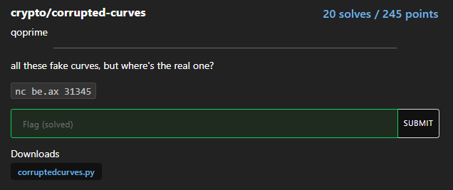
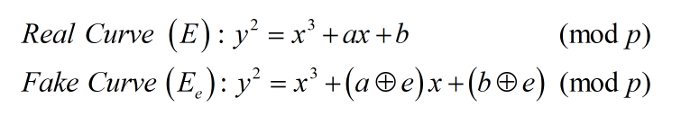
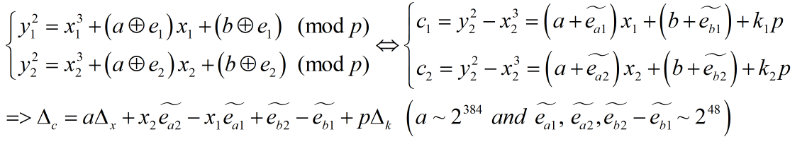
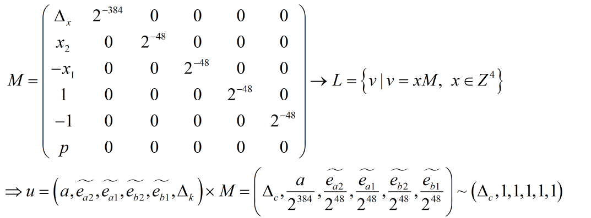
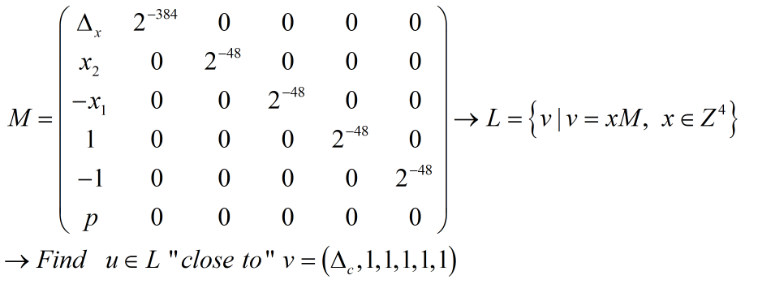

# corrupted-curves+




Sau khi giải bài corrupted-curves+ thì mình thấy lời giải có thể dùng cho bài corrupted-curves được luôn, nên mình sẽ chỉ trình bày cách tổng quát...

```python
from secrets import randbits
from Crypto.Util.number import getPrime
from random import randrange

def square_root(a, p):
    if legendre_symbol(a, p) != 1:
        return 0
    elif a == 0:
        return 0
    elif p == 2:
        return 0
    elif p % 4 == 3:
        return pow(a, (p + 1) // 4, p)
    s = p - 1
    e = 0
    while s % 2 == 0:
        s //= 2
        e += 1
    n = 2
    while legendre_symbol(n, p) != -1:
        n += 1
    x = pow(a, (s + 1) // 2, p)
    b = pow(a, s, p)
    g = pow(n, s, p)
    r = e
    while True:
        t = b
        m = 0
        for m in range(r):
            if t == 1:
                break
            t = pow(t, 2, p)
        if m == 0:
            return x
        gs = pow(g, 2 ** (r - m - 1), p)
        g = (gs * gs) % p
        x = (x * gs) % p
        b = (b * g) % p
        r = m

def legendre_symbol(a, p):
    ls = pow(a, (p - 1) // 2, p)
    return -1 if ls == p - 1 else ls

class EllipticCurve:
    
    def __init__(self, p, a, b):
        self.a = a
        self.b = b
        self.p = p
        if not self.check_curve():
            raise Exception("Not an elliptic curve!")
        
    def check_curve(self):
        discrim = -16 * (4*pow(self.a, 3) + 27*pow(self.b, 2))
        if discrim % self.p:
            return 1
        return 0
    
    def lift_x(self, px):
        y2 = (pow(px, 3) + self.a*px + self.b) % self.p
        py = square_root(y2, self.p)
        if py == 0:
            raise Exception("No point on elliptic curve.")
        return py

with open("flag.txt", "rb") as f:
    flag = f.read()
    flag = int.from_bytes(flag, 'big')

print("Generating parameters...")
while True:
    p = getPrime(512)
    a, b = randbits(384), randbits(384)
    try:
        E = EllipticCurve(p, a, b)
        fy = E.lift_x(flag)
        print(f"p = {p}")
        print(f"flag y = {fy}")
        break
    except:
        continue
checked = set()
count = 0
while count < 2022:
    x = randrange(2, p)
    if int(x) in checked or x < 2**384 or abs(x - p) < 2**384:
        print(">:(")
        continue
    try:
        e = randbits(48)
        print(f"e = {e}")
        E = EllipticCurve(p, a^e, b^e)
        py = E.lift_x(x)
        checked.add(x)
        print(f"x = {x}")
        print(f"y = {py}")
        count += 1
    except:
        print(":(")
    more = input("more> ")
    if more.strip() == "no":
        break
print("bye!")
```

Ý tưởng chung của 2 bài là, đầu tiên sinh bộ (a, b, p: prime) (trong đó ta chỉ biết p) dùng làm tham số cho EllipticCurve sao cho có 1 điểm nào đó thuộc Curve có tọa độ x đúng bằng flag. Sau đó mình được biết các bộ (x, y, e) thuộc "fake curve" (bài đầu thì mình được chọn x còn bài sau thì x được sinh random)



Ta thử biến đổi một chút...



### Closest vector problem

Biến đổi thêm xíu nữa... dưới góc nhìn lattice...



Vậy ý tưởng đã rõ ràng... [Closest vector problem!](https://en.wikipedia.org/wiki/Lattice_problem) ta sẽ tìm được a...




```python
# http://mslc.ctf.su/wp/plaidctf-2016-sexec-crypto-300/
def babai_cvp(B, target):
    B = B.LLL(delta=0.75)
    G = B.gram_schmidt()[0]
    small = target
    for i in reversed(range(B.nrows())):
        c = ((small * G[i]) / (G[i] * G[i])).round()
        small -= c * B[i]
    return target - small

mt = [ 
      [deltax       ,  QQ(1/2^384), 0         , 0             , 0           , 0         ],
      [x2           ,  0          , QQ(1/2^48), 0             , 0           , 0         ],
      [-x1          ,  0          , 0         , QQ(1/2^48)    , 0           , 0         ],
      [ 1           ,  0          , 0         , 0             , QQ(1/2^48)  , 0         ],
      [-1           ,  0          , 0         , 0             , 0           , QQ(1/2^48)],
      [p            ,  0          , 0         , 0             , 0           , 0         ]
]

Basis = Matrix(QQ, mt)
cvp   = babai_cvp(Basis, vector(QQ, [deltac, 1, 1, 1, 1, 1]))
a     = cvp[1] * 2^384
```

có a rồi thừ mọi thứ dường như đã xong!

### solution

```python
from Crypto.Util.number import *

p = 8223087986789035280051866940918282589719354860093319142129744296731295808879996333266655411090480291607568627486984163110794323450383260848298699322320393
fy = 5786965130631085576357593379746542211664496159572355991419185759634308266873774117908311187388012782703794713363367005200797504590199279126170683167985242

a = 3374447228755894062916771368749844037744742735467498296234442893155156299919677947547660966475084776111730207930850
b = 26490460255783524249701599340680356598934425315393006951112459329131256011011815322899216579106058767950117880792620

P.<x> = PolynomialRing(GF(p))
f = x^3 + a*x + b - fy^2
for rt, _ in f.roots():
    flag = long_to_bytes(int(rt))
    if b'corctf{' in flag:
        print(f'[+] Flag: {flag}')

# Flag: corctf{cr4ftin6_f3as1ble_brut3s_unt1l_y0u_mak3_it!}
```

**Flag: corctf{cr4ftin6_f3as1ble_brut3s_unt1l_y0u_mak3_it!}**
{:.success}

**Flag: corctf{i_h0pe_you_3njoyed_p1ecing_t0geth3r_th4t_curv3_puzz1e_:)}**