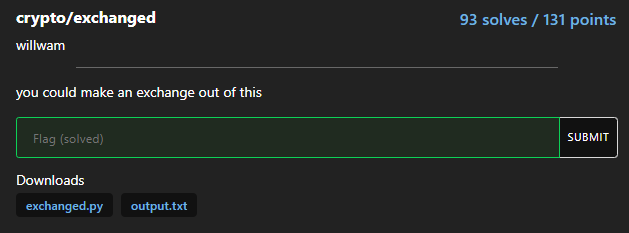
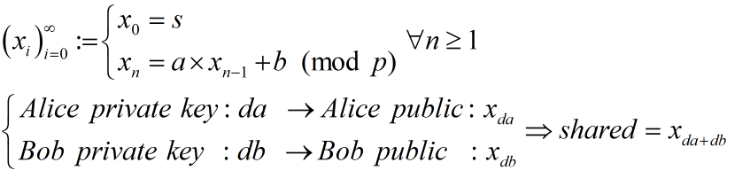
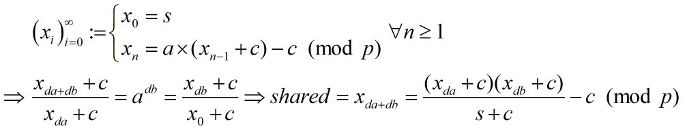

# exchanged



```python
from Crypto.Util.number import *
from Crypto.Cipher import AES
from Crypto.Util.Padding import pad
from hashlib import sha256
from secrets import randbelow

p = 142031099029600410074857132245225995042133907174773113428619183542435280521982827908693709967174895346639746117298434598064909317599742674575275028013832939859778024440938714958561951083471842387497181706195805000375824824688304388119038321175358608957437054475286727321806430701729130544065757189542110211847
a = randbelow(p)
b = randbelow(p)
s = randbelow(p)

print("p =", p)
print("a =", a)
print("b =", b)
print("s =", s)

a_priv = randbelow(p)
b_priv = randbelow(p)

def f(s):
    return (a * s + b) % p

def mult(s, n):
    for _ in range(n):
        s = f(s)
    return s

A = mult(s, a_priv)
B = mult(s, b_priv)

print("A =", A)
print("B =", B)

shared = mult(A, b_priv)
assert mult(B, a_priv) == shared

flag = open("flag.txt", "rb").read()
key = sha256(long_to_bytes(shared)).digest()[:16]
iv = long_to_bytes(randint(0, 2**128))
cipher = AES.new(key, AES.MODE_CBC, iv=iv)
print(iv.hex() + cipher.encrypt(pad(flag, 16)).hex())

# p = 142031099029600410074857132245225995042133907174773113428619183542435280521982827908693709967174895346639746117298434598064909317599742674575275028013832939859778024440938714958561951083471842387497181706195805000375824824688304388119038321175358608957437054475286727321806430701729130544065757189542110211847
# a = 118090659823726532118457015460393501353551257181901234830868805299366725758012165845638977878322282762929021570278435511082796994178870962500440332899721398426189888618654464380851733007647761349698218193871563040337609238025971961729401986114391957513108804134147523112841191971447906617102015540889276702905
# b = 57950149871006152434673020146375196555892205626959676251724410016184935825712508121123309360222777559827093965468965268147720027647842492655071706063669328135127202250040935414836416360350924218462798003878266563205893267635176851677889275076622582116735064397099811275094311855310291134721254402338711815917
# s = 35701581351111604654913348867007078339402691770410368133625030427202791057766853103510974089592411344065769957370802617378495161837442670157827768677411871042401500071366317439681461271483880858007469502453361706001973441902698612564888892738986839322028935932565866492285930239231621460094395437739108335763
# A = 27055699502555282613679205402426727304359886337822675232856463708560598772666004663660052528328692282077165590259495090388216629240053397041429587052611133163886938471164829537589711598253115270161090086180001501227164925199272064309777701514693535680247097233110602308486009083412543129797852747444605837628
# B = 132178320037112737009726468367471898242195923568158234871773607005424001152694338993978703689030147215843125095282272730052868843423659165019475476788785426513627877574198334376818205173785102362137159225281640301442638067549414775820844039938433118586793458501467811405967773962568614238426424346683176754273
# e0364f9f55fc27fc46f3ab1dc9db48fa482eae28750eaba12f4f76091b099b01fdb64212f66caa6f366934c3b9929bad37997b3f9d071ce3c74d3e36acb26d6efc9caa2508ed023828583a236400d64e
```

### LCG-like-DH cryptosystem

Nhìn sơ qua cách encrypt thì giống [Diffie-Hellman](https://en.wikipedia.org/wiki/Diffie%E2%80%93Hellman_key_exchange) nhưng mà thực hiện bằng ... LCG



Ta có thể check và thấy ngay p - 1 smooth tuy nhiên ta cũng không cần nó để giải DLP nếu như chịu khó biến đổi LCG lại cho dễ tính toán hơn...



### solution

```python
from Crypto.Util.number import *
from Crypto.Cipher import AES
from Crypto.Util.Padding import unpad
from hashlib import sha256

p = 142031099029600410074857132245225995042133907174773113428619183542435280521982827908693709967174895346639746117298434598064909317599742674575275028013832939859778024440938714958561951083471842387497181706195805000375824824688304388119038321175358608957437054475286727321806430701729130544065757189542110211847
a = 118090659823726532118457015460393501353551257181901234830868805299366725758012165845638977878322282762929021570278435511082796994178870962500440332899721398426189888618654464380851733007647761349698218193871563040337609238025971961729401986114391957513108804134147523112841191971447906617102015540889276702905
b = 57950149871006152434673020146375196555892205626959676251724410016184935825712508121123309360222777559827093965468965268147720027647842492655071706063669328135127202250040935414836416360350924218462798003878266563205893267635176851677889275076622582116735064397099811275094311855310291134721254402338711815917
s = 35701581351111604654913348867007078339402691770410368133625030427202791057766853103510974089592411344065769957370802617378495161837442670157827768677411871042401500071366317439681461271483880858007469502453361706001973441902698612564888892738986839322028935932565866492285930239231621460094395437739108335763
A = 27055699502555282613679205402426727304359886337822675232856463708560598772666004663660052528328692282077165590259495090388216629240053397041429587052611133163886938471164829537589711598253115270161090086180001501227164925199272064309777701514693535680247097233110602308486009083412543129797852747444605837628
B = 132178320037112737009726468367471898242195923568158234871773607005424001152694338993978703689030147215843125095282272730052868843423659165019475476788785426513627877574198334376818205173785102362137159225281640301442638067549414775820844039938433118586793458501467811405967773962568614238426424346683176754273
enc = bytes.fromhex("e0364f9f55fc27fc46f3ab1dc9db48fa482eae28750eaba12f4f76091b099b01fdb64212f66caa6f366934c3b9929bad37997b3f9d071ce3c74d3e36acb26d6efc9caa2508ed023828583a236400d64e")

c = b * inverse(a - 1, p) % p
shared = ((A + c) * (B + c) * inverse(s + c, p) - c) % p

key = sha256(long_to_bytes(shared)).digest()[:16]
cipher = AES.new(key, AES.MODE_CBC, iv=enc[:16])

flag = unpad(cipher.decrypt(enc[16:]), 16)
print(f'[+] Flag: {flag}')

# FLag: corctf{th1s_lcg_3xch4ng3_1s_4_l1ttl3_1ns3cur3_f0r_n0w}
```

**Flag: corctf{th1s_lcg_3xch4ng3_1s_4_l1ttl3_1ns3cur3_f0r_n0w}**

Hehe bài này nhanh tay ăn được first blood nè :>

