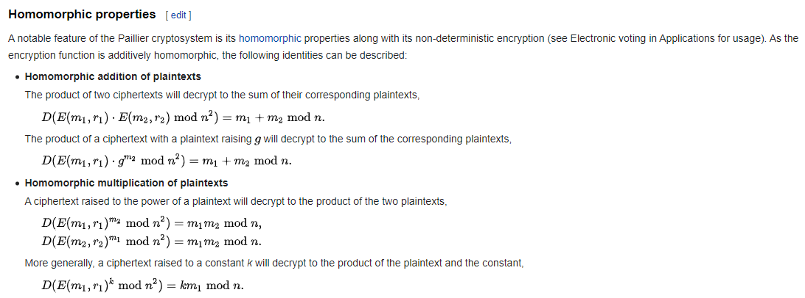
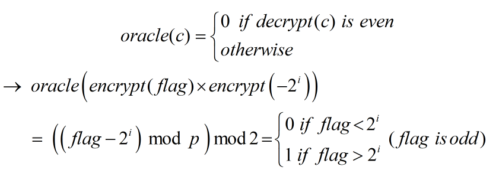

# generous


Ngủ một giấc rồi xem...sao

```python
from Crypto.Util.number import getPrime, inverse, bytes_to_long
from random import randrange

with open("flag.txt", "rb") as f:
	flag = f.read().strip()

def gen_keypair():
	p, q = getPrime(512), getPrime(512)
	n = (p**2) * q
	while True:
		g = randrange(2, n)
		if pow(g, p-1, p**2) != 1:
			break
	h = pow(g, n, n)
	return (n, g, h), (g, p, q)

def encrypt(pubkey, m):
	n, g, h = pubkey
	r = randrange(1, n)
	c = pow(g, m, n) * pow(h, r, n) % n
	return c

def decrypt(privkey, c):
	g, p, q = privkey
	a = (pow(c, p-1, p**2) - 1) // p
	b = (pow(g, p-1, p**2) - 1) // p
	m = a * inverse(b, p) % p
	return m

def oracle(privkey, c):
	m = decrypt(privkey, c)
	return m % 2

pub, priv = gen_keypair()
n, g, h = pub
print(f"Public Key:\n{n = }\n{g = }\n{h = }")
print(f"Encrypted Flag: {encrypt(pub, bytes_to_long(flag))}")
while True:
	inp = int(input("Enter ciphertext> "))
	print(f"Oracle result: {oracle(priv, inp)}")
```

### Okamoto–Uchiyama cryptosystem

Đọc qua cách encrypt thì mình phát hiện đây là [Okamoto–Uchiyama cryptosystem](https://en.wikipedia.org/wiki/Okamoto%E2%80%93Uchiyama_cryptosystem), ta chú ý một tính chất thú vị sau



Bài này biết được bộ public key (n, g, h), vậy ta có thể tự encrypt được. Hơn nữa ta cũng được phép decrypt nhưng chỉ biết được... bit cuối của kết quả.

### LSB oracle

Ta thử sử dụng tính chất homomorphic với LSB orcale để khai thác thông tin từ flag... (chú ý ta dùng LSB oracle và biết được flag lẻ)



Từ đó ta hoàn toàn brute được từng bit của flag...

### solution

```python
from pwn import *
from Crypto.Util.number import *
from random import randrange


def orc(enc):
    io.recvuntil(b"Enter ciphertext> ")
    io.sendline(str(enc).encode())
    io.recvuntil(b'Oracle result: ')
    return int(io.recvline())

def encrypt(pubkey, m):
	n, g, h = pubkey
	r = randrange(1, n)
	c = pow(g, m, n) * pow(h, r, n) % n
	return c


io = remote("be.ax", 31244)
io.recvline()

n = int(io.recvline()[4:])
g = int(io.recvline()[4:])
h = int(io.recvline()[4:])
io.recvuntil(b'Encrypted Flag: ')
c = int(io.recvline())
pub = (n, g, h)

# flag bits...
flag = 2**318 + 1

for i in range(317, -1, -1):
    guess_flag = flag + 2**i
    if 1 == orc(c * encrypt(pub, -guess_flag)%n):
        flag = guess_flag 

print(f'[+] Flag: {long_to_bytes(flag)}')
# Flag: corctf{see?1_bit_is_very_generous_of_me}
```

**Flag: corctf{see?1_bit_is_very_generous_of_me}**