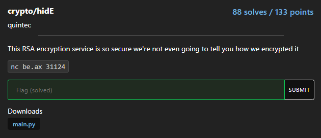
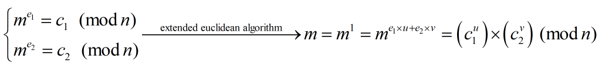

# hidE



Cuối cùng cũng có bài RSA...

```python
import random
import time
import math
import binascii
from Crypto.Util.number import *

p, q = getPrime(512), getPrime(512)
n = p * q
phi = (p - 1) * (q - 1)

flag = open('../flag.txt').read().encode()

random.seed(int(time.time()))

def encrypt(msg):
    e = random.randint(1, n)
    while math.gcd(e, phi) != 1:
        e = random.randint(1, n)
    pt = bytes_to_long(msg)
    ct = pow(pt, e, n)
    return binascii.hexlify(long_to_bytes(ct)).decode()


def main():
    print('Secure Encryption Service')
    print('Your modulus is:', n)
    while True:
        print('Options')
        print('-------')
        print('(1) Encrypt flag')
        print('(2) Encrypt message')
        print('(3) Quit')
        x = input('Choose an option: ')
        if x not in '123':
            print('Unrecognized option.')
            exit()
        elif x == '1':
            print('Here is your encrypted flag:', encrypt(flag))
        elif x == '2':
            msg = input('Enter your message in hex: ')
            print('Here is your encrypted message:', encrypt(binascii.unhexlify(msg)))
        elif x == '3':
            print('Bye')
            exit()

if __name__ == '__main__':
    main()
```

### common modulus attack

Đúng như tên đề bài, ta biết trước modulus n, và có thể tự encrypt được (kể cả flag) nhưng điều... thú vị ở đây là ta không biết được public exponent e. Nhưng một điều cần chú ý là e là số random theo seed là current time nên ta hoàn toàn brute seed để tìm được e từ đó áp dụng common modulus attack để tìm flag



### solution

```python
# Sagemath

from minipwn import *
from Crypto.Util.number import *
import random
import time
import math
from itertools import combinations

def rnd(s):
    E = []
    for i in range(-1, 3):
        random.seed(s + i)
        for _ in range(2):
            e = random.randint(1, n)
            while math.gcd(e, 2) != 1:
                e = random.randint(1, n)
            E.append(e)
    return E


def getencflag():
    io.recvuntil(b'Choose an option: ')
    io.sendline(b'1')
    io.recvuntil(b'Here is your encrypted flag: ')
    return int(io.recvline()[:-1].decode(), 16)

io = remote("be.ax", 31124)
io.recvline()
io.recvuntil(b'Your modulus is: ')
n = int(io.recvline())

seed = int(time.time())

c1 = getencflag()
c2 = getencflag()

E = rnd(seed)
for (e1, e2) in combinations(E, 2):
    _, u, v = xgcd(e1, e2)
    flag = long_to_bytes(int(pow(c1, u, n) * pow(c2, v, n) % n))
    if b'corctf{' in flag:
        print(f'[+] Flag: {flag}')
        break

# FLag: corctf{y34h_th4t_w4snt_v3ry_h1dd3n_tbh_l0l}
```

**Flag: corctf{y34h_th4t_w4snt_v3ry_h1dd3n_tbh_l0l}**