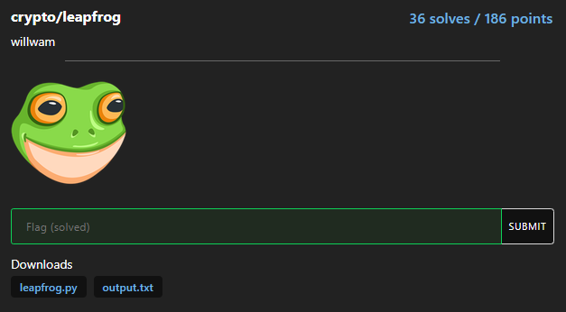
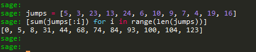
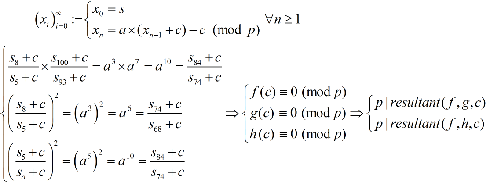
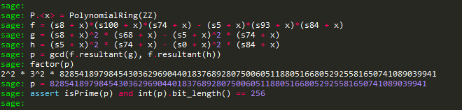

# leapfrog



Lại là LCG, nhưng lần này khó ăn hơn...

```python
from Crypto.Util.number import long_to_bytes, getPrime
from Crypto.Cipher import AES
from Crypto.Util.Padding import pad
from hashlib import sha256
from secrets import randbelow
from random import sample

p = getPrime(256)
a = randbelow(p)
b = randbelow(p)
s = randbelow(p)

def f(s):
    return (a * s + b) % p

jumps = sample(range(3, 25), 12)
output = [s]
for jump in jumps:
    for _ in range(jump):
        s = f(s)
    output.append(s)

print(jumps)
print(output)

flag = open("flag.txt", "rb").read()
key = sha256(b"".join([long_to_bytes(x) for x in [a, b, p]])).digest()[:16]
iv = long_to_bytes(randbelow(2**128))

cipher = AES.new(key, AES.MODE_CBC, iv=iv)
print(iv.hex() + cipher.encrypt(pad(flag, 16)).hex())

# [5, 3, 23, 13, 24, 6, 10, 9, 7, 4, 19, 16]
# [26242498579536691811055981149948736081413123636643477706015419836101346754443, 30320412755241177141099565765265147075632060183801443609889236855980299685595, 65684356693401962957802832810273549345608027337432965824937963429120291339333, 15025547765549333168957368149177848577882555487889680742466312084547650972663, 46764069432060214735440855620792051531943268335710103593983788232446614161424, 71575544531523096893697176151110271985899529970263634996534766185719951232899, 8149547548198503668415702507621754973088994278880874813606458793607866713778, 12081871161483608517505346339140143493132928051760353815508503241747142024697, 65627056932006241674763356339068429188278123434638526706264676467885955099667, 23413741607307309476964696379608864503970503243566103692132654387385869400762, 56014408298982744092873649879675961526790332954773022900206888891912862484806, 77000766146189604405769394813422399327596415228762086351262010618717119973525, 14589246063765426640159853561271509992635998018136452450026806673980229327448]
# 05ac5b17c67bcfbf5c43fa9d319cfc4c62ee1ce1ab2130846f776e783e5797ac1c02a34045e4130f3b8111e57397df344bd0e14f3df4f1a822c43c7a89fd4113f9a7702b0b0e0b0473a2cbac25e1dd9c
```

Nhiệm vụ của ta là tìm lại các tham số a, b, p từ các output được leak theo tự ngẫu nhiên của hàm LCG. Đầu tiên ta tính "vị trí" của các số được leak đối với output của hàm LCG.



### recovering p

Ta thử xây dựng các đẳng thức liên hệ giữa các output được leak...



từ các đẳng thức vừa tìm được, dễ dàng tìm được p...



### recovering a and b

Có được p ta dễ dàng tìm được c từ đó dễ dàng tìm được a và b...


### solution

```python
from Crypto.Util.number import long_to_bytes
from Crypto.Cipher import AES
from Crypto.Util.Padding import unpad
from hashlib import sha256

enc = bytes.fromhex("05ac5b17c67bcfbf5c43fa9d319cfc4c62ee1ce1ab2130846f776e783e5797ac1c02a34045e4130f3b8111e57397df344bd0e14f3df4f1a822c43c7a89fd4113f9a7702b0b0e0b0473a2cbac25e1dd9c")
a = 52090040033040396145969121713991672235321119631392930064155091468397683266049
b = 38843617848108773397122963244804118243817350302362995127983202263014562244895
p = 82854189798454303629690440183768928075006051188051668052925581650741089039941

key = sha256(b"".join([long_to_bytes(x) for x in [a, b, p]])).digest()[:16]
cipher = AES.new(key, AES.MODE_CBC, iv=enc[:16])
flag = unpad(cipher.decrypt(enc[16:]), 16)

print(f'[+] Flag: {flag}')

# Flag: corctf{:msfrog:_is_pr0ud_0f_y0ur_l34pfr0gg1ng_4b1lit135}
```

**Flag: corctf{:msfrog:_is_pr0ud_0f_y0ur_l34pfr0gg1ng_4b1lit135}**