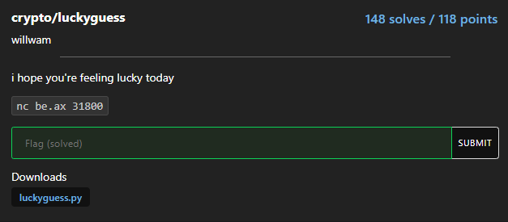

# luckyguess



```python
#!/usr/local/bin/python
from random import getrandbits

p = 2**521 - 1
a = getrandbits(521)
b = getrandbits(521)
print("a =", a)
print("b =", b)

try:
    x = int(input("enter your starting point: "))
    y = int(input("alright, what's your guess? "))
except:
    print("?")
    exit(-1)

r = getrandbits(20)
for _ in range(r):
    x = (x * a + b) % p

if x == y:
    print("wow, you are truly psychic! here, have a flag:", open("flag.txt").read())
else:
    print("sorry, you are not a true psychic... better luck next time")
```

### LCG with fixed point

Đọc sơ qua thì đề cho trước các tham số của [LCG](https://en.wikipedia.org/wiki/Linear_congruential_generator) nhiệm vụ của ta là nhập trước giá trị seed sao cho biết chính xác giá trị y là giá trị thứ r (random) của hàm LCG. Vậy ta chỉ cần tìm điểm bất động của hàm LCG (sẽ là giá trị của seed) khi đó output của LCG sẽ là dãy hằng (seed)...

### solution

```python
from pwn import *
from Crypto.Util.number import *

p = 2**521 - 1

def fixed_point(a, b):
    return b * inverse(1 - a, p) % p

io = remote("be.ax", 31800)
a = int(io.recvline()[4:])
b = int(io.recvline()[4:])
        
x = fixed_point(a, b)

io.recvuntil(b'enter your starting point: ')
io.sendline(str(x).encode())
io.recvuntil(b'alright, what\'s your guess? ')
io.sendline(str(x).encode())

print(io.recvline())

# Flag: corctf{r34l_psych1c5_d0nt_n33d_f1x3d_p01nt5_t0_tr1ck_th15_lcg!}
```

**Flag: corctf{r34l_psych1c5_d0nt_n33d_f1x3d_p01nt5_t0_tr1ck_th15_lcg!}**