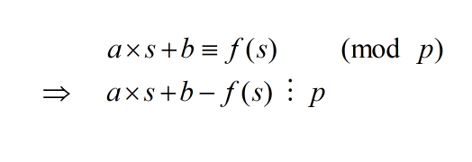

# tadpole


Đầu tiên đọc qua source...

```python
from Crypto.Util.number import bytes_to_long, isPrime
from secrets import randbelow

p = bytes_to_long(open("flag.txt", "rb").read())
assert isPrime(p)

a = randbelow(p)
b = randbelow(p)

def f(s):
    return (a * s + b) % p

print("a = ", a)
print("b = ", b)
print("f(31337) = ", f(31337))
print("f(f(31337)) = ", f(f(31337)))

# a =  7904681699700731398014734140051852539595806699214201704996640156917030632322659247608208994194840235514587046537148300460058962186080655943804500265088604049870276334033409850015651340974377752209566343260236095126079946537115705967909011471361527517536608234561184232228641232031445095605905800675590040729
# b =  16276123569406561065481657801212560821090379741833362117064628294630146690975007397274564762071994252430611109538448562330994891595998956302505598671868738461167036849263008183930906881997588494441620076078667417828837239330797541019054284027314592321358909551790371565447129285494856611848340083448507929914
# f(31337) =  52926479498929750044944450970022719277159248911867759992013481774911823190312079157541825423250020665153531167070545276398175787563829542933394906173782217836783565154742242903537987641141610732290449825336292689379131350316072955262065808081711030055841841406454441280215520187695501682433223390854051207100
# f(f(31337)) =  65547980822717919074991147621216627925232640728803041128894527143789172030203362875900831296779973655308791371486165705460914922484808659375299900737148358509883361622225046840011907835671004704947767016613458301891561318029714351016012481309583866288472491239769813776978841785764693181622804797533665463949
```

đề cho ta hàm đồng dư tuyến tính f (biết luôn a, b) và 2 điểm tương ứng. Vậy ta dễ dàng tìm được flag (modulus p) dựa vào tính chất sau



### solution

```python
from gmpy2 import gcd
from Crypto.Util.number import *

a =  7904681699700731398014734140051852539595806699214201704996640156917030632322659247608208994194840235514587046537148300460058962186080655943804500265088604049870276334033409850015651340974377752209566343260236095126079946537115705967909011471361527517536608234561184232228641232031445095605905800675590040729
b =  16276123569406561065481657801212560821090379741833362117064628294630146690975007397274564762071994252430611109538448562330994891595998956302505598671868738461167036849263008183930906881997588494441620076078667417828837239330797541019054284027314592321358909551790371565447129285494856611848340083448507929914
f =  52926479498929750044944450970022719277159248911867759992013481774911823190312079157541825423250020665153531167070545276398175787563829542933394906173782217836783565154742242903537987641141610732290449825336292689379131350316072955262065808081711030055841841406454441280215520187695501682433223390854051207100
ff =  65547980822717919074991147621216627925232640728803041128894527143789172030203362875900831296779973655308791371486165705460914922484808659375299900737148358509883361622225046840011907835671004704947767016613458301891561318029714351016012481309583866288472491239769813776978841785764693181622804797533665463949

p = gcd(a*31337 + b - f, a*f + b - ff)
flag = long_to_bytes(p)

print(f'[+] Flag: {flag}')

# Flag: corctf{1n_m4th3m4t1c5,_th3_3ucl1d14n_4lg0r1thm_1s_4n_3ff1c13nt_m3th0d_f0r_c0mput1ng_th3_GCD_0f_tw0_1nt3g3rs}
```

**Flag: corctf{1n_m4th3m4t1c5,_th3_3ucl1d14n_4lg0r1thm_1s_4n_3ff1c13nt_m3th0d_f0r_c0mput1ng_th3_GCD_0f_tw0_1nt3g3rs}**