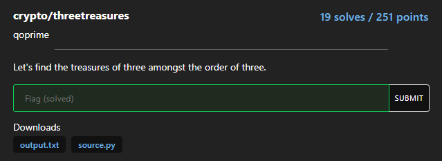
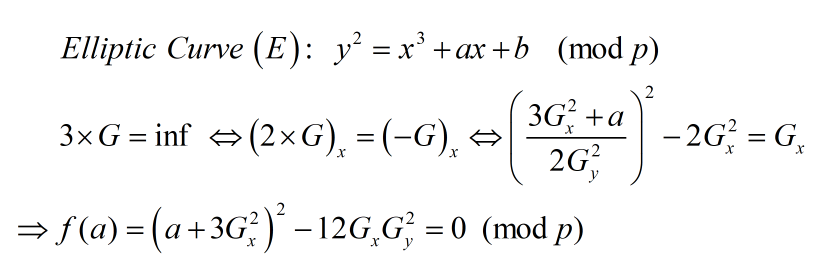

# threetreasures



Bài ECC đầu tiên...

```python
from sage.all import *
from Crypto.Util.number import bytes_to_long, getPrime
from random import getrandbits
from secret import flag, p, x, y

def random_pad(n, length):
    return (n << (length - n.bit_length())) + getrandbits(length - n.bit_length())

flag = bytes_to_long(flag)
fbits = flag.bit_length()
piece_bits = fbits // 3
a, b, c = flag >> (2 * piece_bits), (flag >> piece_bits) % 2**piece_bits, flag % 2**piece_bits

print(a, b, c)
print(f'flag bits: {fbits}')
assert p.bit_length() == 512
q = getPrime(512)
n = p * q
ct = pow(random_pad(c, 512), 65537, n)
E = EllipticCurve(GF(p), [a, b])
G = E(x, y)
assert G * 3 == E(0, 1, 0)
print(f"n = {n}")
print(f"ct = {ct}")
print(f"G = {G}")

# flag bits: 375
# n = 97915144495462666300795364589570761584322186881492143950078938328867290046424857019504657598883431857075772605985768551863478086544857915637724181292135280539943713583281151707224031808445390796342632369109562433275679473233398168787639940620683354458292117457239552762694657810883738834935391913698852811737
# ct = 20363336204536918055183609604474634074539942561101208682977506918349108499764147141944713060658857301108876346227077713201766486360148051069618774935469969057808945271860025712869868421279488925632657486125211168314387620225601572070169746014988350688548088791906161773656057212229972967244998930356157725393
# G = (3115938227771961657567351113281194074601897467086373590156577019504528350118731801249444974253028485083440228959842232653488953448859690520619223338133881 : 2665631524518629436093690344927156713668794128141943350227439039472817541262750706395352700109556004195261826476428128993836186741129487842876154876730189 : 1)
```

### ECC: point doubling formula

Đọc sơ qua thì flag được chặt làm 3 khúc a, b, c (mỗi phần 125 bits), c được mã hóa bằng RSA còn a, b lấy làm tham số cho EllipticCurve. Vậy ta cần xử lý thằng ECC trước, tìm ra (a, b, p) có p thì dễ dàng tìm được c...

Ta được biết thêm tọa độ của điểm G thuộc Curve, điều thú vị là order của nó bằng 3...



Vậy ta đã thiết lập được phương trình nhận a làm nghiệm theo modulus p. Để ý a có 125 bits (thậm chí ta còn biết thêm một số bits đầu của a do b'corctf{') và ta biết n là bội của p nên dùng coppersmith ta dễ dàng tính được a, có a thì mọi chuyện gần như đã xong...

### solution

```python
from Crypto.Util.number import *

fbits = 375
n = 97915144495462666300795364589570761584322186881492143950078938328867290046424857019504657598883431857075772605985768551863478086544857915637724181292135280539943713583281151707224031808445390796342632369109562433275679473233398168787639940620683354458292117457239552762694657810883738834935391913698852811737
ct = 20363336204536918055183609604474634074539942561101208682977506918349108499764147141944713060658857301108876346227077713201766486360148051069618774935469969057808945271860025712869868421279488925632657486125211168314387620225601572070169746014988350688548088791906161773656057212229972967244998930356157725393
Gx, Gy = (3115938227771961657567351113281194074601897467086373590156577019504528350118731801249444974253028485083440228959842232653488953448859690520619223338133881, 2665631524518629436093690344927156713668794128141943350227439039472817541262750706395352700109556004195261826476428128993836186741129487842876154876730189)

a_high_bit = bytes_to_long('corctf{'.encode()) << (125 - 55)
P.<x> = PolynomialRing(Zmod(n))

f = (3*Gx^2 + a_high_bit + x)^2 - 12 * Gx*Gy^2
a_low_bit = f.small_roots(X=2^70, beta=0.49)[0]

a = a_high_bit + a_low_bit
p = gcd(ZZ(f(a_low_bit)), n)
q = n//p
assert isPrime(p) and isPrime(q)

b = (Gy^2 - Gx^3 - a*Gx)%p
c = pow(ct, inverse(0x10001, (p - 1)*(q - 1)), n) >> (512 - 125)

flag = (int(a) << (2*125)) | (int(b) << 125) | int(c)
print(f'[+] Flag: {long_to_bytes(flag)}')

# Flag: corctf{you_have_conquered_the_order_of_three!!}
```

**Flag: corctf{you_have_conquered_the_order_of_three!!}**