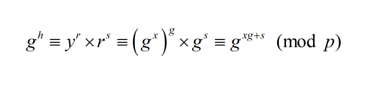
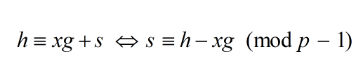
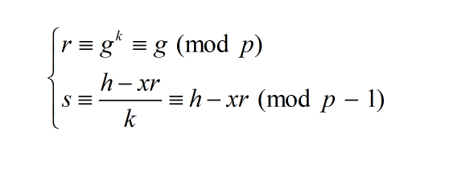
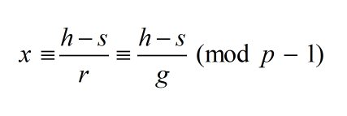

# Sign me
Bài này cho phép mình truy cập vào oracle, được phép get public key, sign (32 lần), verify msg tự chọn và verify msg random nào đây để lấy được flag.

Đọc qua một lượt, mình để ý tới hàm get flag và hàm verify:

```
 def verify(self, pt, r, s):
        if not 0 < r < self.p:
            return False
        if not 0 < s < self.p - 1:
            return False
        h = bytes_to_long(sha256(pt).digest())
        return pow(self.g, h, self.p) == (pow(self.y, r, self.p) * pow(r, s, self.p)) % self.p   

    def get_flag(self):
        try:
            test = b64encode(urandom(self.N))
            print("Could you sign this for me: ", test.decode())
            r = b64decode(input('Input r: '))
            s = b64decode(input('Input s: '))
            if self.verify(test, bytes_to_long(r), bytes_to_long(s)):
                print("Congratulation, this is your flag: ", FLAG)
                exit(0)
            else:
                print("Sorry, that is not my signature")
                exit(-1)
        except Exception as e:
            print(e)
            print("Please send data in base64 encoding")
```
Mình thử chọn các giá trị đặc biệt của r và s (ở đây chú ý giá trị của h hoàn toàn tính được)
* Đầu tiên chọn r = g, khi đó:

<div align="center"> 
    
</div>

* Do đó, để đẳng thức đúng, ta chỉ việc chọn s sao cho:

<div align="center"> 
    
</div>

Từ nhận xét trên, nếu ta tìm được x thì hoàn toàn tính được r và s, từ đó lấy được `flag`. Để tìm x, ta xem thử hàm `sign` hoạt động như thế nào:

```
def sign(self, pt):
        if self.sign_attempt == 0:
            print("Sorry, no more attempt to sign")
            return (0, 0)
        else:
            try:
                msg = b64decode(pt)
                
                if (len(msg) > self.N): # I know you are hecking :(((
                    return (0, 0)
                
                k = sum([coef * m for coef, m in zip(self.coef, msg)])
                if k % 2 == 0: # Just to make k and p-1 coprime :)))
                    k += 1
                
                r = pow(self.g, k, self.p)
                h = bytes_to_long(sha256(pt).digest())
                s = ((h - self.x * r) * inverse(k, self.p - 1)) % (self.p - 1)
                self.sign_attempt -= 1
                return (r, s)
            except:
                print('Please send message in base64 encoding')
```

Hmm, k là tổ hợp tuyến tính bất kì của các byte của msg, vậy mình thử chọn các msg để kiểm soát thằng k rồi phân tích tiếp, ở đây dễ nhất là cho msg = b'\00' khi đó lập tức k = 0 và để nó nguyên tố với p - 1 thì tăng lên 1 thành k = 1.

k = 1 rồi thì lúc này ta thấy:

<div align="center"> 
    
</div>

chú ý msg do mình chọn nên h sẽ tính được, vậy x được tính bằng cách:

<div align="center"> 
    
</div>

nhưng chú ý, g và p - 1 phải nguyên tố cùng nhau mới tính được nghịch đảo, tuy nhiên chúng ta k cần quá lo lắng vì g được sinh ngẫu nhiên và ta thử factor p - 1 thì thấy chỉ có ước nguyên tố nhỏ là 2 nên khi g được sinh ngẫu nhiên thì xác xuất tính được là cao và chúng ta chỉ việc thử khi nào ra flag là được (thực tế mình khá đen nên sau 2, 3 lần ms được :v)

[full code](https://github.com/vnc1106/HCMUS-CTF-2022/blob/main/sign%20me/sol.py)

**`Flag: HCMUS-CTF{B4se64_15_1nt3r3stin9}`**

P/s: theo mình thì bài này không khó và mặt ý tưởng, mình chỉ cần mất tầm 10-15 phút để nháp, nhưng khi code thì lại dính bug quên encode base64  nhiều chỗ dẫn đến tính sai và mất nhiều thời gian để fix nó :((
