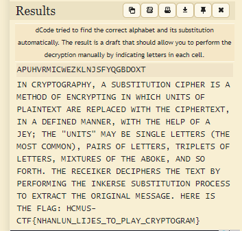

# Subtitution
Đề cho ta đoạn code:

```
from fnmatch import translate
from random import shuffle

msg = ''
with open('../Secret/msg.txt') as file:
    msg = file.read().upper()

ALPHABET = b'ABCDEFGHIJKLMNOPQRSTUVWXYZ'
SUB_ALPHABET = list(b'ABCDEFGHIJKLMNOPQRSTUVWXYZ')
shuffle(SUB_ALPHABET)

translate_dict = {}
for u, v in zip(ALPHABET, SUB_ALPHABET):
    translate_dict[u] = v
    
with open('msg_enc.txt', 'w+') as file:
    file.write(msg.translate(translate_dict))
```

Nhìn sơ qua ta thấy ngay đây là `Subtitution cipher` (hoán vị bảng chữ cái tiếng Anh rồi mã hóa (=> có tất cả 26! trường hợp)). Bài này mình sẽ dùng [tool này](https://www.dcode.fr/monoalphabetic-substitution) để giải. Quăng vô và ta được kết quả:

<div align="center"> 
    
</div>

**`Flag: HCMUS-CTF{NHANLUN_LIKES_TO_PLAY_CRYPTOGRAM}`**

