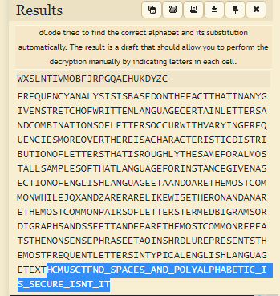

# subtitution1

Bài này hơi khác bài trước là sau khi `sub` các kí tự thì nó còn thêm bước là `shift` thêm một đoạn `offset`. Ở đây nó sẽ mã hóa theo từng `block` có độ dài là 5, vậy ta chỉ cần reverse lại chỗ `shift offset` thì sẽ thành mã `subtitution` như bài trước và lại ném lên tool cho nó giải thui =)) (đây là [code](https://github.com/vnc1106/HCMUS-CTF-2022/blob/main/subtitution1/sol.py) để reverse)

 
    

**`Flag: HCMUS-CTF{NO_SPACES_AND_POLYALPHABETIC_IS_SECURE_ISNT_IT}`**
