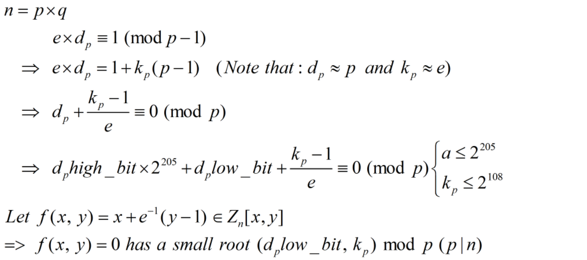

# dp_high

## Solution

Đề khá ngắn gọn, một bài về RSA, ta thử phân tích xem!

Như vậy ta đã thiết lập được 1 đa thức 2 ẩn có nghiệm nhỏ => nghĩ tới coppersmith. Ở đây là coppersmith 2 ẩn, mình dùng code của [defund](https://github.com/defund/coppersmith)

**Flag: ISITDTU{approximating_kp!}**