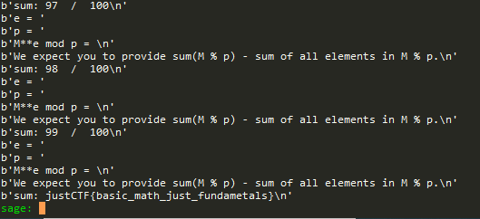

# Solution
Đề cho chúng ta số nguyên tố `p`, số nguyên `e` và ma trận `A = M^e` (các phép tính trên `GF(p)`) và nhiệm vụ của ta là tìm ra ma trận `M` sau đó tính tổng các phần tử bên trong ma trận. Nếu pass qua được 100 test sẽ có flag

Nhìn sơ qua thì bài này khá giống `RSA` nhưng thay vì trên tính GF(p) thì bài này tính trên GL(p), ý tưởng chính vẫn là tìm số `K` nào đó sao cho `M^K = I` (`I` là ma trận đơn vị), `d` sao cho `e*d = 1 (mod K)` khi đó `M` được tính từ `M = A^d`. (Ở đây `K` có công thức tính các bạn có thể tham khảo [tại đây](https://en.wikipedia.org/wiki/General_linear_group)) [full code](https://github.com/vnc1106/justCTF-2022/blob/main/Simply%20Powered/sol.sage)

 
    

**Flag: `justCTF{basic_math_just_fundamentals}`**
