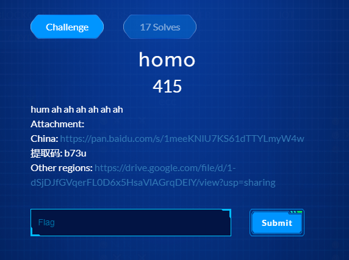
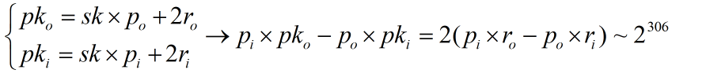
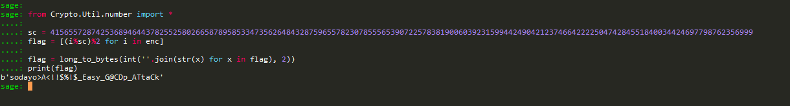

# homo



Đầu tiên ta đọc qua source

```python
from Crypto.Util.number import * 
from secret import flag
from random import *
assert flag.startswith(b'wmctf{') and flag.endswith(b'}')
flaglen = len(flag) - 7
flag = bytes_to_long(flag[6:-1])
pbit = 114
qbit = 514
rbit = 191
keylen = 981
nouse = 0
def keygen():
    pk = []
    sk = getPrime(qbit)
    for i in range(keylen):
        print(i)
        p = getPrime(pbit)
        r = getPrime(rbit)
        pk.append(p*sk + 2*r)
    return pk , sk

def enc(m , pk):
    c = []
    m = [int(i) for i in bin(m)[2:]]
    print(m)
    for i in m:
        tempc = i
        for j in range(keylen):
            if randint(0 , 1):
                tempc += pk[j]
        c.append(tempc)
    return c

    


pk , sk = keygen()
print(sk)
c = enc(flag , pk)

f = open('./pubkey.txt' , 'w')
f.write(str(pk))
f.close()

f = open('./cipher.txt' , 'w')
f.write(str(c))
f.close()
print([(i%sk)%2 for i in c])
print(sk)
```

Ta chú ý đoạn code cuối đề 

```python
print([(i%sk)%2 for i in c])
print(sk)
```

Dễ thấy (hoặc test code thử...) đây cũng chính là cách decrypt, vậy mục đính của ta sẽ là tìm thằng sk, thử viết lại một chút...



Vậy từ đây ta thử build lattice và tìm p0...


Tương tự ta có thể tìm được các giá trị pi còn lại, ứng với mỗi pi ta tìm được 1 xấp xĩ của sk bằng cách tính pki//pi, và dễ dàng "đoán" được giá trị của sk...



**Flag: wmctf{sodayo>A<!!$%!$_Easy_G@CDp_ATtaCk}**