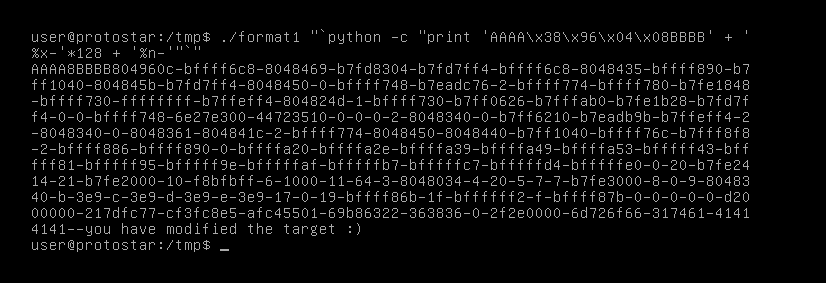

# Format One

## Description

This level shows how format strings can be used to modify arbitrary memory locations.

Hints

* objdump -t is your friend, and your input string lies far up the stack :)

This level is at /opt/protostar/bin/format1

## Source code

```cpp
#include <stdlib.h>
#include <unistd.h>
#include <stdio.h>
#include <string.h>

int target;

void vuln(char *string)
{
  printf(string);
  
  if(target) {
      printf("you have modified the target :)\n");
  }
}

int main(int argc, char **argv)
{
  vuln(argv[1]);
}
```


## Exploit code

Level passed!

<p align="center">
    
</p>